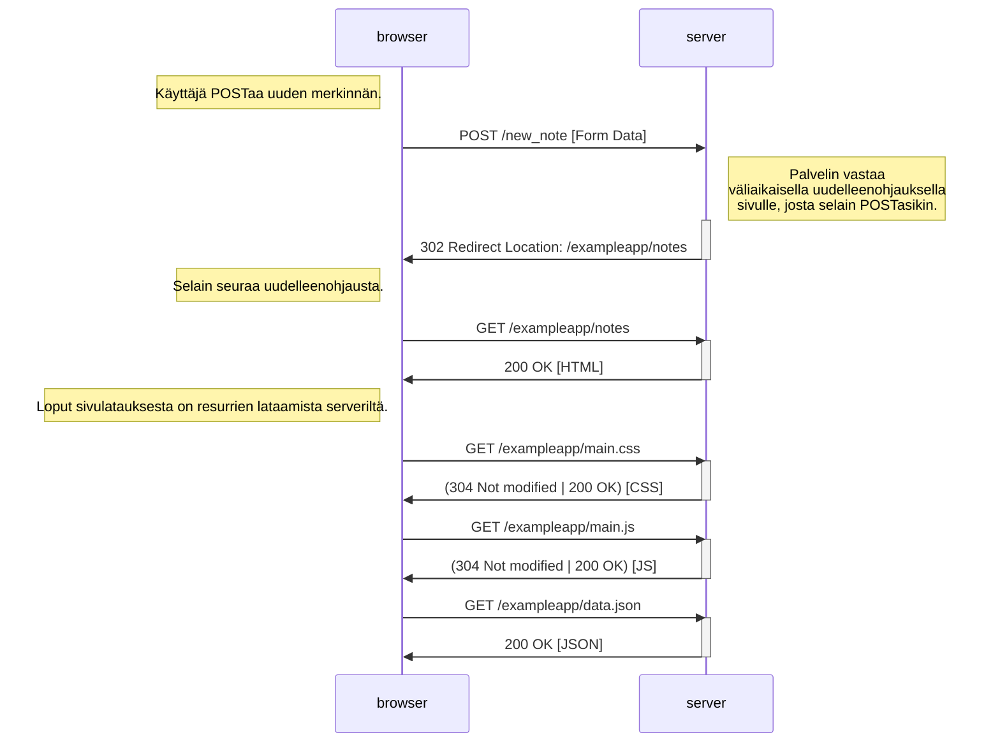

# Tehtävä 0.4

```mermaid
sequenceDiagram
participant browser
participant server

note left of browser: Käyttäjä POSTaa uuden merkinnän.
browser->>server: POST /new_note [Form Data]

note right of server: Palvelin vastaa<br>väliaikaisella uudelleenohjauksella<br>sivulle, josta selain POSTasikin.
activate server
server->>browser: 302 Redirect Location: /exampleapp/notes
deactivate server

note left of browser: Selain seuraa uudelleenohjausta.
browser->>server: GET /exampleapp/notes

activate server
server->>browser: 200 OK [HTML]
deactivate server

note left of browser: Loput sivulatauksesta on resurrien lataamista serveriltä.

browser->>server: GET /exampleapp/main.css

activate server
server->>browser: (304 Not modified | 200 OK) [CSS]
deactivate server

browser->>server: GET /exampleapp/main.js

activate server
server->>browser: (304 Not modified | 200 OK) [JS]
deactivate server

browser->>server: GET /exampleapp/data.json

activate server
server->>browser: 200 OK [JSON]
deactivate server
```

 