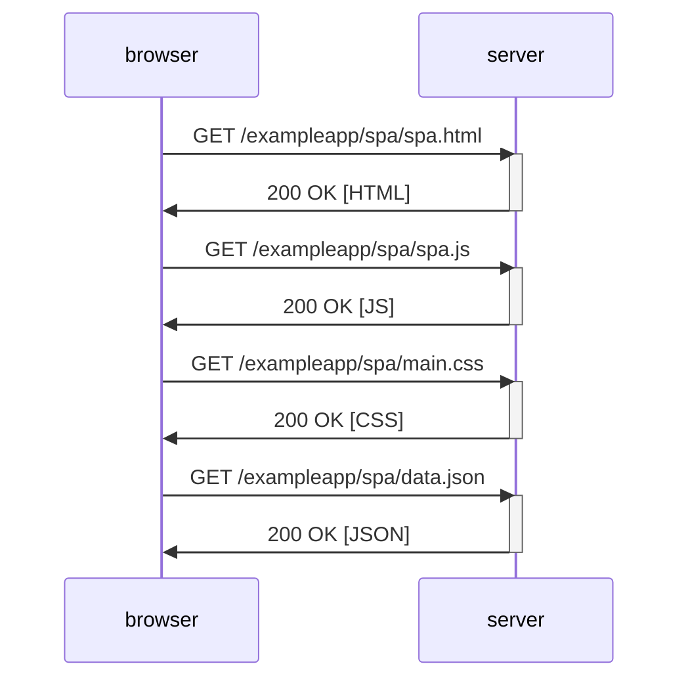

# Tehtävä 0.5

```mermaid
sequenceDiagram
participant browser
participant server

browser ->> server: GET /exampleapp/spa/spa.html

activate server
server ->> browser: 200 OK [HTML]
deactivate server

browser ->> server: GET /exampleapp/spa/spa.js

activate server
server ->> browser: 200 OK [JS]
deactivate server

browser ->> server: GET /exampleapp/spa/main.css

activate server
server ->> browser: 200 OK [CSS]
deactivate server

browser ->> server: GET /exampleapp/spa/data.json

activate server
server ->> browser: 200 OK [JSON]
deactivate server
```