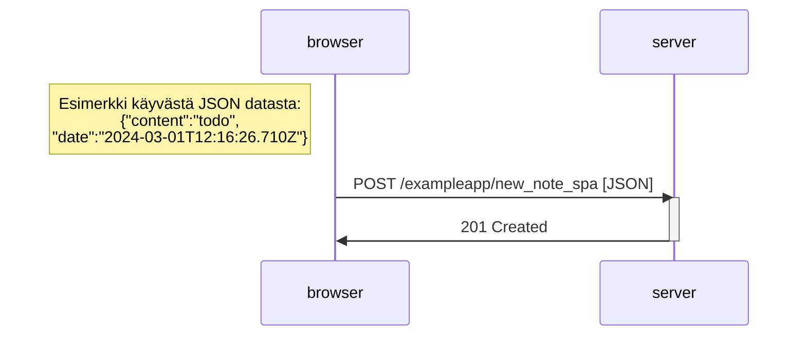

# Tehtävä 0.6

```mermaid
sequenceDiagram
participant browser
participant server

note left of browser: Esimerkki käyvästä JSON datasta:<br>{"content":"todo",<br>"date":"2024-03-01T12:16:26.710Z"}
browser ->> server: POST /exampleapp/new_note_spa [JSON]

activate server
server ->> browser: 201 Created
deactivate server
```